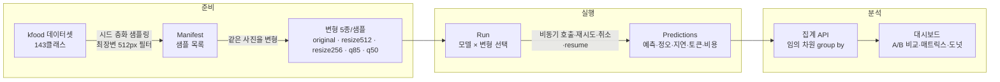
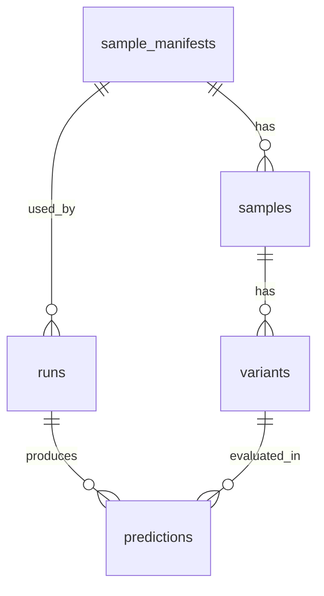
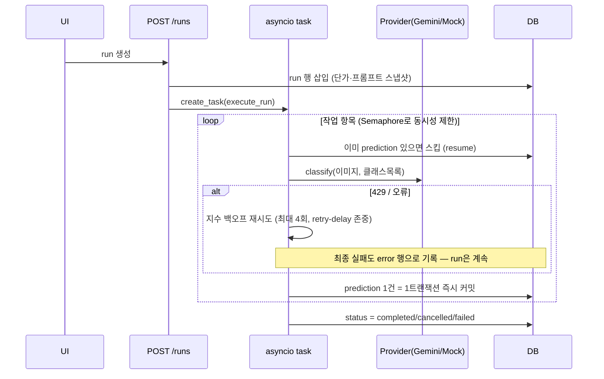

# K-Food AI Profiler — 시스템 문서

음식 사진 판별 모델(Gemini 등)의 성능을 **음식 클래스별 / 이미지 해상도별 / 압축 품질별**로 측정·비교하는 로컬 웹 애플리케이션. 처음 보는 사람이 구조와 동작을 파악할 수 있도록 전체를 설명한다.

- 백엔드: FastAPI + SQLite (`backend/`)
- 프론트엔드: React + Vite + TypeScript + TanStack Query + recharts (`frontend/`)
- 데이터셋: `../kfood/` — 27개 카테고리 / 143개 음식 클래스 / 클래스당 ~1,000장 JPEG (16GB, 저장소 밖)

## 핵심 개념 한 장 요약



**변형(variant)이 이 시스템의 핵심이다.** 해상도/압축 축을 "다른 사진"으로 비교하면 사진 난이도가 섞여버리므로, **같은 사진 한 장을 5가지로 변형**해서 각각 모델에 보낸다. 따라서 변형 간 정확도 차이 = 순수한 해상도/압축의 효과다.

| 변형 | 내용 |
|---|---|
| `original` | 원본 그대로 (참조점 — 이미지마다 해상도가 다르므로 실측값 기록) |
| `resize512` / `resize256` | 최장변 512/256px LANCZOS 축소 (JPEG q85 저장) |
| `q85` / `q50` | 해상도 유지, JPEG 품질 85/50 재인코딩 (파일 크기 축) |

샘플러가 **최장변 512px 미만 이미지를 제외**하므로 resize 변형은 항상 진짜 다운스케일이다.

## 디렉토리 구조

```
profiler/
├── .env                       # GEMINI_API_KEY, USE_VERTEXAI, GOOGLE_CLOUD_PROJECT
├── data/                      # 런타임 산출물 (gitignored)
│   ├── profiler.db            # SQLite
│   └── variants/{sample_id}/  # 변형 이미지 캐시 (5파일/샘플)
├── backend/app/
│   ├── main.py                # FastAPI 앱 + startup(DB init, 중단 run 정리)
│   ├── config.py              # pydantic-settings (.env)
│   ├── orm.py                 # SQLAlchemy 모델 (스키마의 원본)
│   ├── db.py                  # 엔진·세션 (WAL 모드)
│   ├── dataset.py             # 데이터셋 스캔 (NFC 정규화 담당)
│   ├── sampler.py             # 샘플링 + manifest 빌드
│   ├── variants.py            # Pillow 변형 생성
│   ├── grading.py             # 라벨 정규화 + 채점
│   ├── runner.py              # run 실행기 (핵심 로직)
│   ├── aggregate.py           # group-by 집계 쿼리
│   ├── models_registry.py     # 모델 카탈로그 + 단가표
│   ├── providers/             # 모델 호출 추상화 (gemini, mock)
│   ├── routers/               # API 엔드포인트
│   └── tests/                 # pytest (mock E2E 포함)
└── frontend/src/
    ├── api/                   # 타입 + fetch 클라이언트
    └── pages/                 # Manifests / Runs / Dashboard / Predictions
```

## DB 스키마 (SQLite, `backend/app/orm.py`)



### sample_manifests — 샘플셋 정의
| 컬럼 | 설명 |
|---|---|
| `name` (UNIQUE), `seed`, `per_class` | 샘플링 파라미터. 같은 시드 = 항상 같은 샘플 |
| `class_filter` (JSON) | 사용할 클래스 목록 (NULL = 전체 143개) |
| `variant_types` (JSON) | 생성한 변형 종류 |
| `status` | `creating → ready / failed` |

### samples — 샘플 1장 = 원본 사진 1장
| 컬럼 | 설명 |
|---|---|
| `class_label`, `category` | **NFC 정규화된** 정답 라벨 (예: 김치찌개 / 찌개) |
| `rel_path` | 데이터셋 루트 기준 경로. UNIQUE(manifest_id, rel_path) |
| `orig_width/height/bytes` | 원본 실측값 (원본은 불균일: 최장변 190~3264px) |

### variants — 샘플 1장 × 변형 5종
| 컬럼 | 설명 |
|---|---|
| `variant_type` | original / resize512 / resize256 / q85 / q50 |
| `file_path` | `data/variants/{sample_id}/{type}.jpg` |
| `width/height/bytes` | **실측값** (라벨이 아니라 실측으로 집계 가능하게) |

### runs — 테스트 실행 1회
| 컬럼 | 설명 |
|---|---|
| `model_id`, `provider` | 카탈로그 키 (예: gemini-3.8-flash-thinking) |
| `api_path` | `api-key`(AI Studio) 또는 `vertex` — **경로별 이미지 토큰화가 달라 비용이 다름** |
| `prompt_text`, `prompt_version` | 실행 시점 프롬프트 스냅샷 |
| `cost_per_m_input/output` | **실행 시점 단가 스냅샷** (단가표가 바뀌어도 과거 비용 불변) |
| `status` | pending → running → completed / cancelled / failed |
| `total_items` | 샘플 수 × 선택 변형 수 |

### predictions — 호출 1회의 결과
| 컬럼 | 설명 |
|---|---|
| `run_id` + `variant_id` | **UNIQUE — resume의 기반** (있으면 스킵) |
| `status` | ok / error (재시도 소진 후 실패도 행으로 기록 — run은 계속됨) |
| `raw_response`, `predicted_label` | 원문 응답 + 정규화 라벨 |
| `is_correct` | 정규화 exact match 결과 |
| `latency_ms` | 성공한 시도의 API 왕복 시간 |
| `input/output_tokens`, `cost_usd` | usage 실측 (output에 thinking 토큰 합산) |

## API (`backend/app/routers/`)

| 메서드·경로 | 설명 |
|---|---|
| `GET /api/dataset/classes` | 데이터셋 클래스 목록 (라벨·카테고리·이미지 수) |
| `GET /api/models` | 모델 카탈로그 (단가·thinking 여부 포함) |
| `POST /api/manifests` | manifest 생성 → 백그라운드로 샘플링+변형 생성 시작 |
| `GET /api/manifests` · `/{id}` · `/{id}/classes` | 목록 / 상세 / 클래스별 요약 |
| `DELETE /api/manifests/{id}` | 삭제 (참조하는 run이 있으면 409) |
| `POST /api/runs` | run 생성 + 즉시 실행 시작 |
| `GET /api/runs` · `/{id}` | 목록 / 상세 |
| `GET /api/runs/{id}/progress` | `{done, errors, total, status, elapsed_s, est_cost_so_far}` — UI가 1.5초 폴링 |
| `POST /api/runs/{id}/cancel` | 취소 (완료분 보존) |
| `POST /api/runs/{id}/resume` | 이어서 실행 — **성공분 스킵, 에러분은 지우고 재시도** |
| `DELETE /api/runs/{id}` | run + predictions 삭제 (실행 중이면 409) |
| `GET /api/results/aggregate` | `run_ids` + `group_by`(run_id, model_id, class_label, category, variant_type 조합) → count/accuracy/latency/tokens/cost |
| `GET /api/predictions` | 개별 예측 조회 (run/클래스/변형/정오/샘플 필터 + 페이지네이션) |
| `GET /api/images/variants/{id}` · `/samples/{id}` | 변형 이미지 / 원본 이미지 서빙 |

집계는 `aggregate.py`의 **단일 파라미터화 쿼리** 하나로 모든 대시보드 뷰를 처리한다: `predictions ⋈ variants ⋈ samples ⋈ runs`를 임의 차원으로 GROUP BY.

## 핵심 로직

### 1. 샘플링 (`sampler.py`)
- 클래스별 독립 시드 `random.Random(f"{seed}:{class_label}")`로 셔플 → **클래스를 추가/제거해도 다른 클래스의 샘플은 불변**.
- 셔플 순서대로 JPEG 헤더(SOF 마커)만 읽어 치수 검사 → **최장변 ≥ 512px**인 이미지만 per_class장 채택.
- 채택된 샘플마다 변형 5종 생성(멱등 — 파일+행 있으면 스킵). 완료되면 manifest가 `ready`.

### 2. 채점 (`grading.py`)
```python
normalize(s) = unicodedata.normalize('NFC', s).strip().replace(' ', '')
is_correct = normalize(예측) == normalize(정답)
```
**NFC 정규화가 필수인 이유**: macOS(APFS)는 한글 폴더명을 NFD(자모 분해형)로 반환한다. 정규화 없이는 화면상 같아 보이는 "김치찌개"가 바이트 단위로 달라 전부 오답 처리된다. `dataset.py`(입수 시)와 `grading.py`(채점 시) 두 곳에서 중앙 처리한다.

### 3. 프롬프트 (closed-set 분류)
manifest에 포함된 전체 클래스 목록을 프롬프트에 넣고 **그중 하나만 답하게** 한다 (143클래스 ≈ 1.5k 토큰). Gemini에는 enum 구조화 출력(`response_mime_type="text/x.enum"` + enum 스키마)으로 목록 밖 답변을 차단한다. 목록은 모든 변형·모델에 동일하므로 축 비교를 오염시키지 않는다.

### 4. Run 실행기 (`runner.py`)

- **진행률은 순수 DB 조회** (`count(predictions)/total_items`) — 서버가 재시작돼도 정확.
- **취소**: cancel_event를 워커가 항목 사이에서 확인. 완료분은 보존.
- **resume**: `UNIQUE(run_id, variant_id)` 덕분에 성공분은 자동 스킵, 에러 행은 지우고 재시도.
- **startup 복구**: 서버 재시작 시 `running`으로 남은 run을 `failed`로 마킹 (resume 가능).

### 5. 프로바이더 (`providers/`)
```python
class VisionProvider(ABC):
    async def classify(image_bytes, mime, class_list, prompt, *, truth_label, item_key) -> PredictionResult
```
- **gemini.py**: google-genai SDK. 429는 `RateLimitError`(retry-delay 포함)로 구분. **thinking 처리**가 중요:
  - thinking 토큰은 출력 단가로 과금되므로 `thoughts_token_count`를 output_tokens에 합산 (누락 시 비용 4배 과소계상 사고 있었음).
  - thinking off 모델: `thinking_budget=0` 시도 → 일부 모델(3.5-flash-lite)은 400으로 거부하므로 자동으로 config 생략 폴백.
  - thinking on 모델: `thinking_budget=-1` (동적)로 명시.
  - 인증: `USE_VERTEXAI=true`면 ADC 기반 Vertex AI(GCP 크레딧 과금), 아니면 `GEMINI_API_KEY`(AI Studio). **같은 이미지도 Vertex가 입력 토큰을 더 많이 계산**하므로(실측 +654토큰/호출) run에 `api_path`를 기록해 구분한다.
- **mock.py**: 정답률 설정 가능(기본 0.8), item_key 시드로 결정적 — **API 비용 0으로 전체 E2E 테스트** 가능.
- 새 모델 추가 = `models_registry.py`에 한 줄 (+새 프로바이더면 클래스 하나).

### 6. 비용 계산
```
cost_usd = input_tokens/1M × 단가_in + output_tokens/1M × 단가_out   (run의 스냅샷 단가)
```
단가는 `models_registry.py`에서 관리. **Gemini 3.8 Flash는 2026-12-31까지 인트로 가격($0.75/$3.75), 2027-01-01부터 2배** — 시점에 맞게 갱신 필요.

## 프론트엔드 (`frontend/src/pages/`)

| 페이지 | 역할 |
|---|---|
| **ManifestsPage** | 클래스 목록, manifest 생성(이름/시드/장수/클래스 선택), 변형 생성 상태 |
| **RunsPage** | run 실행(모델·변형·동시성, thinking 반영 사전 비용 추정), 진행률 폴링, 취소/이어서 실행/삭제 |
| **DashboardPage** | run **최대 2개 선택 → A/B 비교** (합산 없음). A/B 요약 표(차이 열), 변형별 정확도/처리시간 차트, 원본 대비 상대 성능 표, 클래스별 정확도(비교 시 차이 큰 순), 오답 카테고리 도넛(상위 7+기타), 클래스×변형 매트릭스(오답 있는 클래스만 기본 표시). 매트릭스 셀/클래스 막대 클릭 → **예측 상세 다이얼로그**(샘플별×변형별 예측, 사진 클릭 시 원본 라이트박스) |
| **PredictionsPage** | 예측 드릴다운: 필터(run/클래스/변형/정오) + 페이지네이션, raw 응답, 같은 사진의 변형 5종 비교 스트립 |

상태 관리는 TanStack Query만 사용(폴링 포함). dev 서버는 `/api → localhost:8000` 프록시.

## 실행 방법

```bash
# 백엔드 (:8000)
cd backend && .venv/bin/uvicorn app.main:app --port 8000
# 프론트엔드 (:5173)
cd frontend && npm run dev
# 테스트 (API 비용 0 — mock E2E 포함 8개)
cd backend && .venv/bin/python -m pytest
```

`.env` (profiler 루트):
```
GEMINI_API_KEY=...            # AI Studio 경로
USE_VERTEXAI=true             # (선택) Vertex AI = GCP 크레딧 과금
GOOGLE_CLOUD_PROJECT=...      # Vertex 사용 시 필수 (사전: gcloud auth application-default login)
```

## 함정 목록 (겪고 고친 것들)

1. **NFC/NFD**: macOS 한글 폴더명은 NFD. 정규화 누락 시 전 예측이 오답 처리됨.
2. **thinking 토큰 과금**: usage의 `thoughts_token_count`는 출력 단가로 과금되는데 `candidates_token_count`에 안 들어있다. 합산 누락 시 비용 기록이 실제 청구의 1/4이 된다. 분류 작업엔 thinking을 끄는 게 비용 1/3, 속도 1.7배 이득.
3. **`thinking_budget=0` 400 오류**: 모델마다 지원이 다름 (3.8-flash는 필요, 3.5-flash-lite는 거부·기본 off). 프로바이더가 자동 폴백.
4. **API 경로별 토큰 차이**: 같은 이미지를 AI Studio는 ~1,793, Vertex는 ~2,447 입력 토큰으로 계산. 비용 비교는 같은 `api_path`끼리만 공정.
5. **원본 불균일**: 원본 해상도가 190~3264px로 제각각 → 샘플러의 ≥512px 필터 + 실측값 저장으로 대응.
6. **레이트 리밋/지출 한도**: 429는 재시도-백오프, 그래도 실패하면 error 행 → resume이 재시도. AI Studio 월 지출 한도(spend cap) 초과도 429로 온다.
